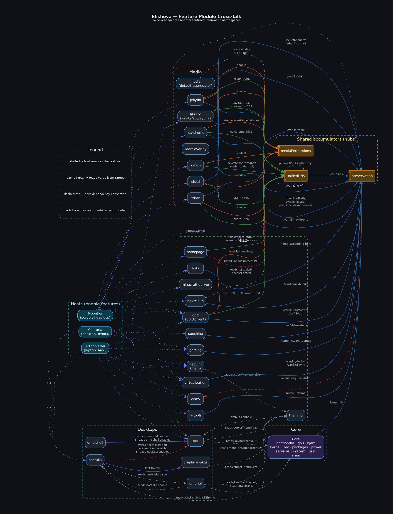

# Elisheva

Personal NixOS flake managing multiple machines with a modular, feature-based architecture (each feature is opt-in via an `enable` flag to avoid hardcoding).

## Hosts

| Host | Type | GPU | Storage |
|---|---|---|---|
| **Centuria** | Desktop | RTX 3060 12GB | 512GB NVMe |
| **Moontier** | Server | AMD Radeon | 6TB |
| **Arthoplerau** | Laptop | AMD Radeon | 512GB + 1TB NVMe (dual) |

## Structure

```
Hosts/           per-machine entry point (imports hardware.nix + Features)
Features/
├── Core/        always enabled: hardware & services shared across hosts
├── Desktops/    graphical sessions
├── Media/       self-hosted media (Jellyfin, etc.)
└── Misc/        everything else
```

Feature dirs are **auto-imported** — drop any `.nix` file into a folder and it's picked up. Hosts enable features in `Hosts/<name>/default.nix`; each feature exposes `options.features.<name>.enable` gated by `config = mkIf cfg.enable`.

## Impermanence

With `features.preservation`, `/` is tmpfs and **only what's declared survives a reboot**. Persistent mounts: `/nix`, `/persistent`, `/boot`.

Everything lives on a single btrfs filesystem (`/persistent`), which on two-drive hosts (`features.disko.dualDrive`) spans both NVMe drives as one pool — `data single` (files land on one device, so a dying drive only costs its own files) with `metadata raid1`.

- **System state** (`features.preservation.system.*`) → `/persistent`.
- **Home** (`features.preservation.home.*`) → `/persistent`.

One-drive hosts are identical; they just have a smaller pool.

## Modules cross-talk

